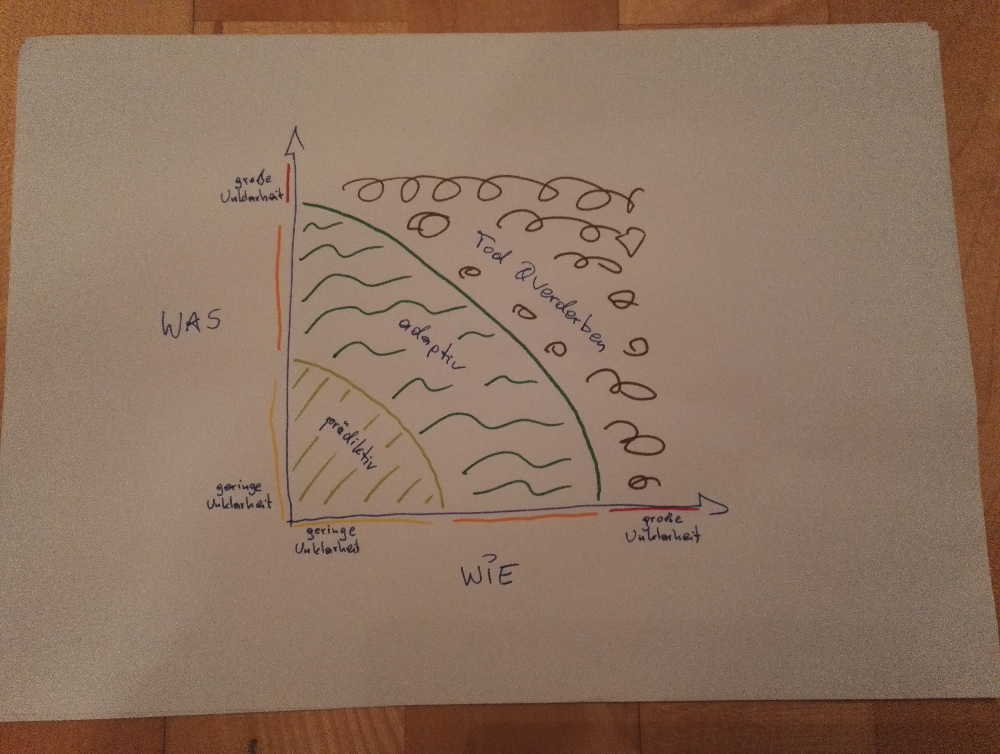
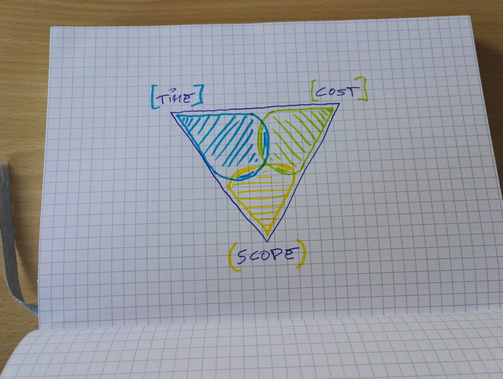

Was ist modernes Projektmanagement für mich? Von welchen Methoden schreibe ich da eigentlich die ganze Zeit? Eine kurze Zusammenfassung.

### Modernes Projektmanagement ist agil

Und nein, ich meine damit nicht agile Projektmanagementmethoden. Die sind zwar für mich auch Teil des Stacks eines modernen Projektmanagers. Aber ich meine _agil_ im Sinn des Wortes: flexibel, wendig. Bereit, sich nicht nur auf Änderungen einzustellen, sie zu akzeptieren, sondern sie auch zu antizipieren. Die Veränderung als Teil des Alltages zu sehen und sie zum eigenen Vorteil zu nutzen. Auf der Welle zu reiten, anstatt von ihr überrollt zu werden. Das klingt jetzt sehr nach Motivational Poster, ich weiß. Aber so ist es nun mal meiner Meinung nach.

### Modernes Projektmanagement ist weder Fisch noch Fleisch…

..weder Scrum noch Wasserfall, um mal die zwei Gegenpole derer, die [Projektmanagement als Religion sehen](/too-scrum), zu nennen. Modernes Projektmanagement ist für mich - je nach Situation, in der sich das Projekt und sein Umfeld gerade befinden - prädiktiv und/oder adaptiv.  
Sprich, eine moderne Projektmanagerin, ein moderner Projektmanager beherrscht mehrere PM-Methoden und wendet die jeweils am besten zur aktuellen Phase des Projektes und seines Umfeldes passende aus. Diese Fixierung auf eine Methode/ein Framework, wie man sie in vielen Unternehmen antrifft, macht doch keinen Sinn. Im Gegenteil - sie lähmt einen, sie kann sogar eine ganze Organisation lähmen.  
Ein Handwerker hat verschiedenste Werkzeuge, deren Anwendung er beherrscht und die er je nach Situation auswählt. Oder habt Ihr schon mal einen Tischler mit einer Hobel ein Loch bohren gesehen?  
Und ich denke, wir Projektarbeiter sind auch Handwerker. Natürlich im übertragenen Sinne. Aber wir haben einen Kasten voller Werkzeuge (in unserem Fall Prozesse), die wir so einsetzen müssen, dass die höchste Effizient und Effektivität gegeben ist. Und ob dieses Werkzeug jetzt _Scrumban_ heißt, oder _V-Model_, ist unter dem Strich vollkommen egal, solange es uns eben effizient und effektiv zu unserem Ziel führt.

### Die Qual der Wahl

Und wie wählen wir nun aus, welches Werkzeug das jeweils richtige für unser Projekt ist? Das Zauberwort heißt für mich **Komplexitätsmatrix**. In meinen ersten Seminaren und Vorträgen habe ich noch die Matrix von [Ralph D. Stacey](https://en.m.wikipedia.org/wiki/Ralph_D._Stacey) (der übrigens großartige Bücher zum Thema Leadership und Komplexität schreibt) auf Flipcharts gezeichnet. Im Lauf der Jahre und Erfahrungen ist sie dann zu der hier mutiert:

A long story short: wenn mein Projekt links unten angesiedelt ist, sind “klassische” Methoden - also ein Plan - wahrscheinlich die bessere Wahl. Ist mein Projekt aktuell weiter rechts und oben auf der Matrix zu finden, sind agile Methoden - also Planung - eher zielführend.

### Gemeinsamkeiten

Und was haben all diese Methoden gemeinsam? Haben sie überhaupt etwas gemeinsam? Ich finde, das umgedrehte _Projektmanagementdreieck_ ist universell. Iron Triangle, nur umgedreht. Triple Constraint auf den Kopf gestellt. Trilemma. Mit Venn-Diagramm. Ich weiß, das Ding ist schon lange nicht mehr aktuell. Aber zur Abstraktion ist es in meinen Augen besser geeignet als Sterne und Wolken. Ich habe also noch ein Action Painting für Euch gemalen (stellt Euch vor, das hier wäre ein Vortrag und ich male auf einem Flipchart herum):

Auch, wenn es einige Fallen enthält, aber wir sollten unseren Fokus auf die Schedule- und Cost-Baselines setzen. Eine Fixierung auf den Scope ist einfach in unseren heutigen, schnelllebigen Zeit der Untergang eines jeden Projektes. Wie kann ich den Umfang eines Projektes - das ja per definitionem dazu da ist, etwas Neues, in der Form noch nie dagewesenes zu erschaffen - im Vorhinein festlegen, wenn sich Technologien konstant ändern und entwickeln? Eine Vision zu haben von dem, was ich da bauen will: auf jeden Fall! Und manchmal zwingen mich gesetzliche Vorgaben, dass ich mir sehr genau überlege, wie das fertige Produkt aussieht (ich sag nur Bauverhandlung). Aber je mehr ich mich auf etwas konkretes festlege, desto schwerer tue ich mir mit Änderungen. Und da ist es egal, ob ich innerhalb einer bürokratisierten Organisation Change Requests aufüllen muss, oder ob ich User Stories ändern darf, solange sie nicht Teil eines Sprints sind. Wir Menschen ticken so, dass wir uns nur schwer von etwas trennen können, was wir uns in allen Details ausgemalt haben.  
Also Scope Baseline: ja, unbedingt! Aber wenn wir uns darauf einstellen, dass die nicht in Stein gemeißelt ist, sondern sich ändern kann, sind wir wesentlich besser aufgestellt.

### Eine Methode, sie alle zu binden

Jetzt beherrschen wir also mehrere Methoden und Prozesse und setzen sie je nach Situation ein. Klingt ganz schön unstrukturiert, oder? Meiner Erfahrung nach kann das Ganze nur funktionieren, wenn wir all unsere verschiedensten Werkzeuge auf Basis eines soliden Fundamentes einsetzen. Damit meine ich eine **Metamethode**, die unsere ganzen Methoden zusammenhält. Quasi die Mutter aller Frameworks. Der eine Ring. Oder wie auch immer Ihr das nennen wollt.

Diese Methode muss in der Lage sein, uns den ganzen Projektzyklus
(Initiating, Planing, Executing, M&C, Closing - Ihr wisst, was ich meine) sicher zu strukturieren. [PMBOK](https://www.pmi.org/pmbok-guide-standards) eignet sich in meinen Augen recht gut, weil es sich ständig weiterentwickelt. Oder man verwendet ein agiles Metaframework wie [Scaled Agile](https://www.scaledagileframework.com). Aber wie so oft gilt auch hier: **Gut ist es, wenn es für Dich funktioniert**.

### Modernes Projektmanagement ist nicht dogmatisch, sondern pragmatisch

Zusammenfassend sollten wir also mehrere Projektmanagementmethoden, -ansätze und -frameworks beherrschen. Und damit meine ich theoretisch und praktisch. Klar, alles macht man irgendwann das erste Mal. Und die Praxis kommt mit der Erfahrung. Aber damit ich diesen Punkt überhaupt erreiche, muss ich die Erfahrung initial von mir aus mir erarbeiten. Darum traut Euch und probiert mal was Neues aus.

Und zum Abschluss der für mich wichtigste Teil des Ganzen. Und da ist es egal, ob wir von “modernem” PM, oder von adaptiven, prädiktiven, von Wasserfall, oder wasauchimmer reden:
_Failed communication... failed project_. Eine moderne Projektmanagerin, ein moderner Projektmanager ist für mich immer jemand, die oder der das Fachwissen und die Erfahrung nur als Hintergrund und Basis für den menschlichen Teil betrachtet. Das versuche ich, jeden Tag umzusetzen. Egal, wohin die Reise geht. Dazu mehr ein anderes Mal.
