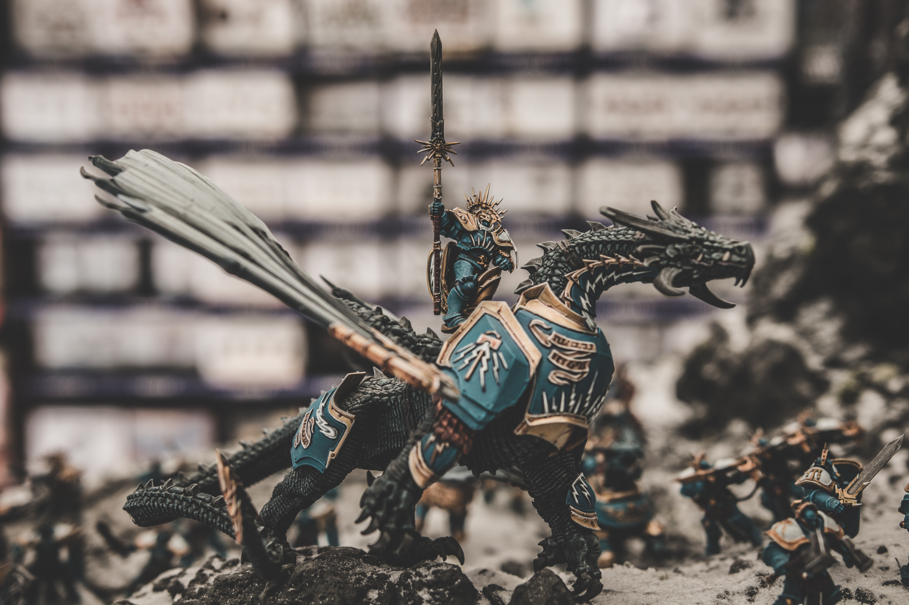

Scrum in kleinen Teams

Ich werde auf Seminaren und Vorträgen immer wieder gefragt, ob agile Methoden - und dort vor allem Scrum - auch für kleine Teams geeignet sind. Meine Antwort ist dann die Standardantwort aller Dampfplauderer: es hängt davon ab. Natürlich geht es dort nicht, wo das Organisationsumfeld es nicht zulässt. Aber in diesen Fällen ist die Teamgröße vollkommen egal. Solange die Struktur und Kultur in diesen Firmen nicht angepasst werden, werden große und kleine Teams mit Scrum scheitern. Aber sehen wir uns die potentiell möglichen Fälle einmal genauer an.

### Wie groß muss so ein Scrumteam mindestens sein?

Der [Scrumguide](https://www.scrumguides.org) ist da ziemlich eindeutig: nicht weniger als drei Entwickler. Kommen noch mindestens Scrum Master und Product Owner hinzu. Dann sind wir bei **fünf Teammitgliedern**  
Bei vielen taucht dann die Frage auf: “Kann ich nicht die beiden Rollen Scrum Master und Product Owner zusammenlegen?” Natürlich geht das. Ich kann auch in meiner Brotfabrik die beiden Rollen Bäcker und LKW-Fahrer zusammenlegen. Gehen tut es. Ist es sinnvoll? Ganz klar nein! In dem einen Fall wird mein Brot viel zu spät zu den Kunden gebracht werden. Was egal ist, weil es ohnehin nicht rechtzeitig fertig werden wird. In dem anderen Fall werden so viele Konflikte auftreten, dass das Team nicht mehr ungestört arbeiten kann. Warum? Vereinfacht: weil der Product Owner subjektiv und der Scrum Master objektiv zu sein hat. Der eine vertritt Kundeninteressen (und oft auch die eigenen, wir sind alle nur Menschen). Der andere vertritt die Interessen aller. Wenn ich diese beiden Rollen in einen einzelnen Menschen hinein packe, bekomme ich Doktor Jekyll und Mister Hyde - einen zerrissenen und leicht schizophrenen _Productmasterownerscrum_, der wie ein Scheidungskind nicht weiß, auf wessen Seite er sich jetzt schlagen soll. Und ja, es gibt sicher irgendwo die eine oder den einen, die diesen Spagat zustande bringen. Aber in der Regel trage ich gewaltig Unruhe und damit auch eine sinkende Produktivität in mein Team, wenn Scrum Master und Product Owner ein und dieselbe Person sind.

### Aber benötige ich immer einen Product Owner?

Jein. Natürlich ist der Product Owner wichtig, keine Frage. Jeder, der das Gegenteil behauptet, hat noch nie einen guten Product Owner erlebt. Aber wir reden hier von kleinen Teams. Und da finde ich das Konzept des _Story Owners_ recht hilfreich. Ein Story Owner ist ein Teammitglied, das sich um den kompletten “Life Cycle” einer User Story kümmert. Von der Erstanforderung und Erstellung, über Business Analyse, Refinement und Umsetzung in Iterationen mit Kundenfeedback bis hin zum Release. Also quasi ein Product Owner für eine einzelne Story. Und das muss nicht bei Scrum und Softwareentwicklung aufhören, das funktioniert meiner Erfahrung nach mit allen agilen Methoden - Projektmanagement wie Operations.  
Und wenn in einem kleinen Team jede und jeder Story Owner ist, komme ich mit **vier Teammitgliedern** aus.

### Und dieser Scrum Master, was macht der überhaupt den ganzen Tag?

Gute Frage.Wenn ich philosophisch werden wollen würde… ich hab mir den Satzanfang jetzt dreimal durchlesen müssen, ob er richtig ist. Würde ich philosophisch werden wollen (sicher ist sicher), würde ich davon schreiben, dass gar keinen Scrum Master zu haben besser ist, als einen schlechten Scrum Master zu haben. Aber wir gehen davon aus, dass der in unserem Beispiel hier ein guter ist. Und der ist wahnsinnig wichtig. Er muss aber nicht full-time im Team sitzen. Vor allem bei kleineren Teams, wo Konflikte schneller sicht- und somit auch schneller lösbar sind. Und die Zahl der Kommunikationskanäle sinkt auch schneller als die Zahl der Teammitglieder.

#### Ein kleiner Exkurs

Wer sich nicht sicher ist, wie ich das mit den Kommunikationskanälen meine, hier ein kleiner Einschub.  
Ich kann die Anzahl der potentiellen Kommunikations”linien” mit einer recht einfachen Formel berechnen:

> (n * (n - 1)) / 2

n ist die Anzahl der Kommunizierenden, in unserem Fall also der Teammitglieder. Und wenn ich diese Formel für die Anzahl an Menschen, die laut Scrumguide Sinn machen (also drei bis sieben) einsetze, bekomme ich folgende Zahlen:

| Teamgröße | Anzahl Kanäle |
| --- | --- |
| 3 | 3 |
| 4 | 6 |
| 5 | 10 |
| 6 | 15 |
| 7 | 21 |

Ihr seht also, dass bei kleineren Teams sehr viel an Kommunikationsaufwand wegfällt. 

#### Zurück zum Scrum Master

Wenn der Scrum Master [gerade nicht beim Team sitzt](/in-wievielen-teams-kann-ein-scrum-master-sitzen/), bedeutet das ja nicht, dass keiner sich mehr um das Team kümmert. Ich habe beobachtet, dass in so Momenten die Hauptaufgaben des Scrum Masters - wenn ich diese jetzt grob platt mache, würde ich sagen, der “Kümmerer” - oft vom _Senior_ im Team übernommen werden.  
Das bedeutet, wenn ich jemanden außerhalb des Teams habe, der das Team ab und zu im Sinne eines Scrum Masters betreut (Retros leiten, nach dem Rechten sehen, Team abschirmen, moderieren, Steine aus dem Weg räumen, etc. - Ihr wisst, was ich meine, Ihr kennt das alles) und ansonsten die Scrum Master-Aufgaben von einzelnen Teammitgliedern übernommen werden, benötige ich plötzlich nur mehr **drei Teammitglieder**.

### Warum jetzt aufhören?

Lasst uns die Kommunikationskanaltabelle mal kurz weiterführen:

| Teamgröße | Anzahl Kanäle |
| --- | --- |
| 2 | 1 |

Ein Kommunikationskanal, klar. Bei zwei Personen im Raum, können nur a und b miteinander reden. Und ein Kommunikationskanal ist noch unkomplizierter als drei Kommunikationskanäle. Also **zwei Teammitglieder**. Wobei auch zwei Personen miteinander streiten können. Also noch einen weg und ich komme wieder zu meiner initialen Überschrift:

### One-man-scrumteam

Ein Scrumteam mit nur einem Teammitglied. Wenn ich so ein Team bin, kümmere ich mich um alles selbst. Da steht dann die User Story - fast schon gezwungenermaßen, aber auf jeden Fall automatisch - plötzlich im Mittelpunkt. Wenn alle Nebengeräusche, die in so einem selbstorganisierendem Team nun mal anfallen, verstummen, bleibt der _Customer Value_. Keine Diskussionen, keine Eitelkeiten, nur der pure Wert.

### Zurück zur Realität

Natürlich ist das ein sehr abstraktes Gedankenexperiment und natürlich habe ich bewusst ausgeschmückt und weggelassen. Aber so ein Ein-Frau- bzw. Ein-Mann-Scrumteam kann

1. funktionieren (und funktioniert auch) und 
2. uns wertvolle Ideen und Lösungsansätze bieten. Wenn ich etwas komplett abstrahiere und reduziere, wird Komplexität meiner Meinung nach leichter greifbar.

Das bedeutet, ich kann auch mit weniger als fünf Personen erfolgreich ein agiles Projektteam haben. Natürlich sind die Zahlen im Scrumguide und in anderen Methodiken (drei bis sieben Teammitglieder plus ein Product Owner und ein Scrum Master) wohl überlegt und basieren auf vielen Gedanken und vor allem Learnings und Best Practices. Aber manchmal ist die Realität eben einfach anders als die Theorie es sich vorstellt. Und auch dann kann ich meiner Erfahrung nach tolle Resultate erzielen, wenn ich ein paar Punkte beherzige. Und was all diese Vorschläge gemeinsam haben: sie erfordern sehr engagierte Teammitglieder und sie fordern diese Teammitglieder auch. Aber mit motivierten Menschen ist das alles kein Problem.
