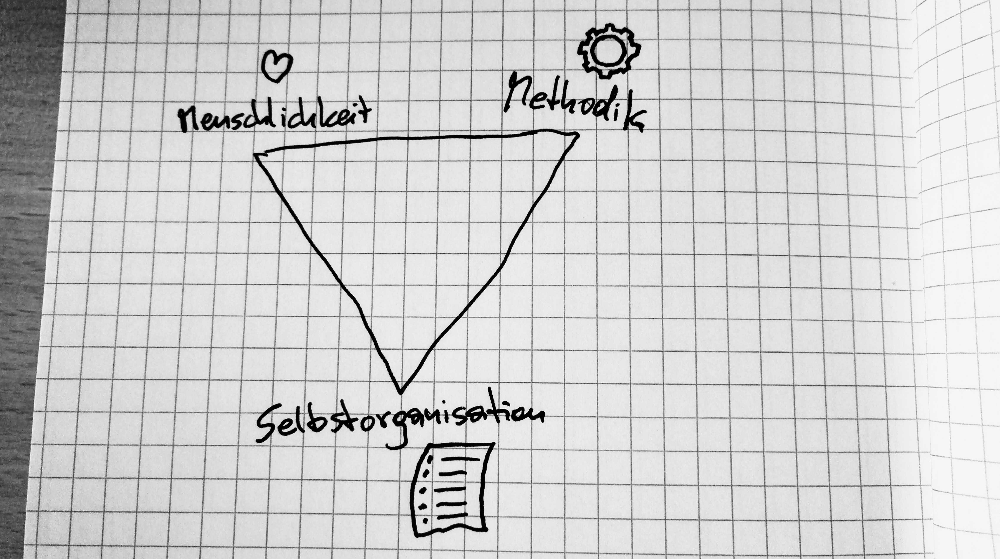
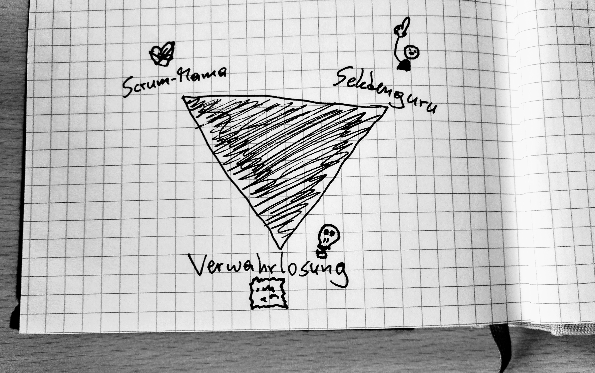

Auch Scrum Master haben ihr Dreieck. Sogar ein ganz besonderes. Und warum das auch alle Agile Coaches, Lean Senseis, und wie auch immer Ihr Euch nennt, betrifft.

### Dreiecke über Dreiecke

Wir Projektarbeiter kennen Trilemmas nur zu gut: das [Projektmanagement-Dreieck](https://en.wikipedia.org/wiki/Project_management_triangle) ist so eines. Ich habe drei Bedingungen und kann nicht eine davon verändern, ohne die anderen beiden zu beeinflussen. Klar, wenn ich den Umfang eines Projektes erweitere, muss ich entweder mehr Geld in die Hand oder mehr Zeit in Kauf nehmen. Doch damit nicht genug. Ich muss außerdem alle Bedingungen erfüllen: Scope, Time, Cost. Denn wenn einer der Eckpunkte des Dreiecks quasi am Boden schleift, kommt mein ganzes Projekt in Schieflage.

Scrum Master haben auch so ein Dreieck. Sogar ein zweiseitiges. Und ein ziemlich herausforderndes noch dazu. Wenn ich die Eckpunkte nämlich nicht erfülle, wandeln sie sich in etwas Negatives um. Und das betrifft nicht nur mein aktuelles Projekt, sondern mein ganzes Team.

### Wovon redet der Kerl?

Sehen wir uns zuerst die positive Ausprägung des _Scrum Master-Dreieckes_ an. Die Eigenschaften, die ich als Scrum Master / Agile Coach / Sensei / Wasauchimmer erfüllen, bzw. die ich meinem Team vorleben sollte.

#### Menschliche Unterstützung

Als Scrum Master sollte ich mein Team vor allem menschlich unterstützen. Der Klassiker: Steine aus dem Weg räumen. Das Team coachen. Dabei begleiten, besser zu werden. _Facilitating_. Für [richtige Kommunikation](/warum-wir-nicht-richtig-kommunizieren/) sorgen. Konflikte sauber lösen. Vorbild sein. Ihr kennt das alles.  
Das Ganze ist ein stetiger Prozess. Da muss ich auch viel und konstant an mir selber arbeiten.

#### Methodische Unterstützung

Was bringt mir das beste Framework, wenn ich mich nicht an seine Grundregeln halte? Nichts. Und auch hier reden wir von einer der Kernaufgaben einer jeden Scrum Masterin, eines jeden Scrum Masters. Wir haben darauf zu achten, dass das Team sich an die Spielregeln hält. Und wenn wir hier nicht päpstlicher sind, als der Papst, fahren wir meiner Meinung nach recht gut. Sprich, wenn mein Team z.B. beim _Daily_ nicht aufstehen, sondern sitzenbleiben will, und wenn ich das Gefühl habe, die hören einander zu und machen das richtig gut, dann sollen sie doch bitte sitzen bleiben. Denn wenn ich sie zwinge, aufzustehen und an das Whiteboard zu treten, ist es mein Daily. So ist es ihr Daily. Und nun ratet mal, welches der beiden sie machen werden, wenn ich als Scrum Master mal einen Tag lang weg bin.

#### Unterstützung zum Entwickeln von Selbstständigkeit und Selbstorganisation

Die dritte wichtige Aufgabe von Scrum Mastern. In meinen Augen sogar die wichtigste. Denn ein selbstständiges und selbstorganisiertes Team wird auch dann noch ein selbstständiges und selbstorganisiertes Team sein, wenn der Scrum Master nicht da ist. So einfach ist das.

Aber nun sehen wir uns mal an, was passiert, wenn ich diese drei Kernaufgaben nicht, oder nur unzulänglich erfülle.

### Komm zur dunklen Seite. Wir haben Kekse.

Was soll denn schon passieren, wenn ich die Anforderungen des Dreieckes nicht erfülle? Das kann ja nicht so schlimm sein, oder? In meinen Augen schon! Wenn ich die Themen schleifen lasse, kehren sie sich in ihr Gegenteil um. Von etwas sehr Positivem in etwas sehr Negatives.

#### Scrum Mama

Wenn ich mein Team unterstütze, darf ich nie vergessen, dass die alle - in der Regel - erwachsen sind. Und Steine (oder _Impediments_, wenn Ihr so wollt) aus dem Weg zu räumen ist wahnsinnig wichtig. Aber ich darf das nicht mit Arbeit abnehmen verwechseln. Und es gibt Aufgaben, die können meine Teammitglieder gut erledigen, ohne dass ihre Arbeit darunter leidet. Warum? Weil diese Aufgaben Teil ihrer Arbeit sind, ganz einfach.

Und wenn ich mich um alles kümmere, werde ich irgendwann - verzeiht bitte meine Ausdrucksweise - meinen Teammitgliedern den Hintern abwischen. Und die Scrum Master, die das machen (und glaubt mir, da gibt es verdammt viele) haben die besten Intentionen. Und die sind auch recht beliebt bei ihren Teams. Nur bedeutet beliebt nicht automatisch auch respektiert. Und diese Teams sind dann auch das komplette Gegenteil von selbstorganisiert: sie sind de facto komplett hilflos.

#### Sektenführer

Was passiert, wenn ein Scrum Master die Methodiken immer wichtiger werden lässt? Und was steckt dahinter? Beantworten wir die zweite Frage zuerst, denn dafür benötigen wir nur ein einziges Wort: Unsicherheit. Und dahinter wiederum steckt meiner Beobachtung nach oft eine Mischung aus einer unsicheren Persönlichkeit und fehlendem Know-How. Wenn ich fachlich und/oder technisch keine Ahnung habe, wovon das Team denn da gerade redet, werde ich versuchen, die Fachkompetenz auszuspielen, die ich habe: Scrum.

Und was passiert nun? [Rituale werden wichtiger als alles andere](/too-scrum/). Wie wenn der Inka-Hohepriester oben auf der Pyramide mit blutigen Gedärmen umherwedelt und keiner da unten so genau weiß, warum und wofür das Ganze jetzt gut sein soll, sitzen die Scrum Teams dann brav in allen Meetings und nicken mit den Köpfen. Warum ist das gefährlich? Weil Sektenführer ihre Schafe immer eng um sich scharren. Klar, wenn die Teammitglieder Kontakt mit anderen haben, werden sie schnell merken, wie verrückt das alles ist. Also tendieren Sektenführer-Scrum Master gerne dazu, ihre Teams abzuschoten. Nach dem Motto, “Die Welt da draußen ist böse und ungerecht. Also scharrt Euch alle eng um mich, denn nur ich kann Euch beschützen. Und wehe, Ihr widersprecht mir! Dann schicke ich Euch alleine ins Dunkel.”  
Ihr findet, ich übertreibe? Dann seht Euch so Teams mal genauer an.

#### Verwahrlosung

Dieses Eck meines _Scrum Master-Dreieckes_ hat die größte Auswirkung. Wenn ich mein Team nicht zu einer entsprechenden Selbstorganisation coache und in dieser Selbstorganisiertwerdung unterstütze und ich das Team dann in die scheinbare Selbstständigkeit entlasse, wird es komplett auseinanderfallen. Und da ist es dann egal, ob ich Scrum anwende, oder Wasserfall: ein unproduktives Team tut seiner Organisation richtig weh.

### Und wie wandle ich Dunkles in Helles um?

Manchmal ist es eigentlich ganz einfach. Wenn ich eine Scrum Mama bin, muss ich nur aufhören, eine zu sein. Sowas geht nicht von heute auf morgen, schon klar. Aber ich muss schrittweise in die richtige Richtung kommen. Mein Team nur mehr dort unterstützen, wo wirklich Impediments auftreten. Und es bricht keinem Teammitglied ein Zacken aus der Krone, wenn er ab und zu nach einem Meeting die Gläser ab- und in den Geschirrspüler einräumt.

Als Sektenführer tue ich mir schon um einiges schwerer. Da hängt es stark davon ab, wie verpfuscht das Team ist. Wenn das Sektiererische nur leichte Ausprägungen angenommen hat, kann man da gut gegensteuern. An meinem Selbstwertgefühl arbeiten und Know-How aufbauen.  
Wenn das Ganze tiefer geht, sollte man sich Gedanken machen, den Scrum Master auszuwechseln. So hart das im ersten Moment auch sein wird.

Und vernachlässigte Teams benötigen eigentlich nur eines: Aufmerksamkeit. Und unterm Strich brauchen wir das alle mal ab und zu, oder?
