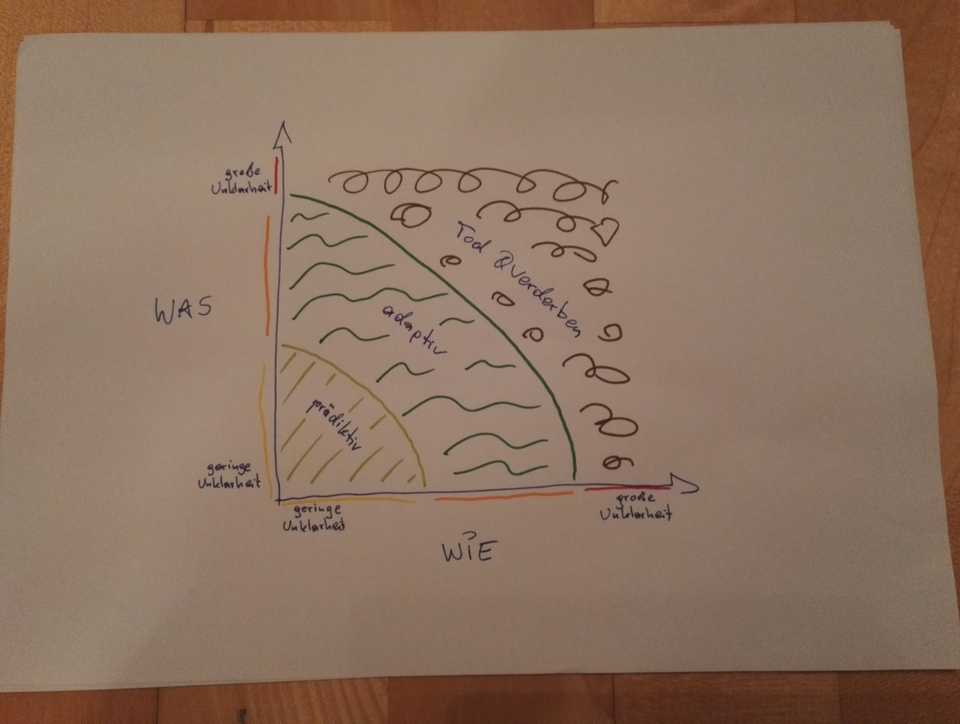

Eine Evolution des Schätzens. Von klassisch über agil und wieder zurück.

### Die Basis

Reden wir doch zu Beginn einmal über das Schätzen, wie es im klassischen Projektmanagement vorkommt. Und ich meine damit richtiges Schätzen. Sprich, der Projektleiter oder das Projektteam erstellt eine Work Breakdown Structure bis hinunter zu den Arbeitspaketen. Dann ruft der Projektmanager einen Mitarbeiter an und fragt nach einer zeitlichen Schätzung für ein Arbeitspaket. Kann das funktionieren? Ja natürlich! Es gibt keine bessere Methode. Wenn - und hier kommt das große wenn. Wenn ich in meiner Komplexitätsmatrix links unten bin. Geringe Unklarheit, was ich mache und wie ich es mache.

Denken wir zum Beispiel an eine Baustelle. Der Maler wird vom Projektleiter gefragt, wie lange er benötigt, eine Wohnung auszumalen. Wenn er die korrekten Input-Parameter bekommt (Wandfläche, Material, etc.), kann er eine sehr genaue zeitliche Schätzung abgeben. Klar, wir sind hier im Graubereich zwischen Projektarbeit und Operations. Zwischen _Change_ und _Run_. Zwischen Projekt- und Prozessmanagement. Im Normalfall hat so ein Maler so eine Wohnung bereits viele Male ausgemalen. Und irgendwann weiß er dann sehr genau, wie lange er dafür benötigt. (Und ja, da können Unwägbarkeiten auftreten, die die Dauer beeinflussen. Aber dafür haben wir ja unser Risk Management.)

### Immer diese Komplexität

Nun wandern wir mal in unserer Komplexitätsmatrix nach rechts oben. Und jetzt wird es kompliziert, um nicht zu sagen komplex (pardon the pun!). Denn wenn ich dem Maler nicht sagen kann, was genau seine Aufgabe sein wird, wird er sie nicht abschätzen können.  
Deshalb hat man sich alternative Schätzmethoden einfallen lassen, die alle eines gemeinsam haben: den Versuch, die zeitliche Komponente aus der Schätzung heraus zu nehmen. Dann bleibt die inhaltliche Seite über und ich kann relational, also in Abhängigkeit zu einem Vergleichsaufwand, schätzen.

Mein Lieblingsbeispiel ist die Wegschätzung. Ich habe keine Ahnung, wie weit es von Salzburg nach Hamburg ist. Aber den Weg von Salzburg nach München kenne ich richtig gut. Und Salzburg - Hamburg ist geschätzt das sechsfache der Strecke Salzburg - München. _Scrumler_ kennen das recht gut: wenn Salzburg - München mein Vergleichsaufwand, meine eins, ist, ist Salzburg - Hamburg eine sechs. Sechs _wasauchimmer_. Steine, Punkte, Aufwände, Story Points.
### Immer diese Teams

Projektarbeit ist meist Teamarbeit. Also sollte auch das Schätzen Teamarbeit sein. Und hier habe ich ein Problem: jedes Team hat sein(e) Alphamännchen. Und ja, ich weiß, diese Theorie ist in der Verhaltensforschung mittlerweile recht veraltet. Aber Ihr wisst, von wem ich rede: die dominanten Teammitglieder. Und so jemand neigt erstens dazu, sich selbst zu überschätzen und zweitens, im Team als erster eine Schätzung heraus zu rufen. Und die eher ruhigen Charaktere im Team trauen sich dann nicht, zu widersprechen und schließen sich der (oft falschen) Schätzung an. Und dann hab ich das Gegenteil von dem erreicht, was ich erreichen will: ich habe erst recht wieder keine Teamschätzung.

### Immer diese Kartenspiele

Hier hat sich irgendwann ([2002, um genau zu sein](https://wingman-sw.com/articles/planning-poker)) auf Basis der Delphi-Methode das _Planning Poker_ etabliert. Die Teammitglieder haben ein Set Karten mit Zahlen darauf (meist die Fibonacci-Skala bis 13 und dann noch 20 und 40 dazu). Jeder legt nun eine Karte mit seiner Schätzung verdeckt vor sich ab und auf 1-2-3 drehen alle ihre Karte um. Wenn jeder den gleichen Wert geschätzt hat: sehr gut. Wenn nicht, wird diskutiert und dann so lange erneut geschätzt und geredet, bis sich alle einig sind. Ihr kennt das Prozedere.

Was ich oft beobachte: bei den Diskussionsrunden setzt sich erst recht wieder das Alpha-Männchen durch. Jaha, werdet Ihr jetzt sagen. Dafür haben wir ja unsere Scrum Masterin, unseren Scrum Master, die oder der das entsprechend moderiert und dafür sorgt, dass auch die Bedachteren zu Wort kommen. Aber genau da wollte ich hin: wenn ich als Scrum Master so gut bin, dass ich durch Moderation(-stechniken) einen ausgeglichenen Konsens herstellen kann, warum zur Hölle lasse ich dann noch alle Teammitglieder lustig Karten auf den Tisch legen? Spieltrieb? Machtgelüste? Gewohnheit.

### Immer dieses Hinterfragen

Wenn wir doch gerade dabei sind, unsere liebgewonnenen Traditionen und Gewohnheiten zu hinterfragen: was passiert denn, wenn wir unsere Stories bar jeglicher zeitlicher Komponente rein inhaltlich geschätzt haben? Wir stopfen sie in den nächsten Sprint. Nochmal: wir nehmen die zeitliche Komponente aus dem Schätzen heraus, um das Resultat in ein zeitliches System zu bringen. Macht das für Euch Sinn? Für mich nicht.  

Warum schätzen wir dann überhaupt? Ich weiß schon, warum wir schätzen. Und ja, da gibt es die Velocity. Aber es gibt eine Situation, in der ich das alles eigentlich nicht mehr benötige: wenn ich nach inkrementellen, iterativen oder agilen Methoden vorgehe, erreicht mein Team - ein entsprechend (gutes) Coaching vorausgesetzt - irgendwann den Punkt, an dem die Mitglieder ein ausgezeichnetes Bauchgefühl dafür entwickelt haben, was sie im nächsten Sprint so alles schaffen werden. Egal, ob da dann Nummern auf den User Stories oben stehen, oder nicht. Und wenn mein Team diesen Punkt erreicht hat, benötige ich eigentlich keine Schätzungen und keine Velocity mehr.

### Immer dieses aber

Es gibt Situationen, in denen die Schätzung von User Stories trotzdem noch Sinn macht.

- Allen voran natürlich die Compliance-Komponente. Wenn der Gesetzgeber oder die Zertifizierung eine Schätzung verlangt, werde ich nur schwer darum herum kommen.
- Das Management redet bei so Dingen auch oft gern ein Wörtchen mit. Stichwort _Monitoring & Controlling_.
- Wenn ich als Scrum Master das Gefühl habe, der Output des Teams schwankt stark und [das mit Zahlen untermauern will](/pimp-my-burn-down-chart).
- Und das Wichtigste: wenn das Team sich ohne Planning Poker nicht wohl fühlt, dann werde ich es (zumindest initial) nicht weglassen.

Aber - und hier kommt das _Gegenaber_: wenn ich die Schätzung nur aus organisatorischen Gründen benötige, spare ich mir - und meinem Team - mit einer Expertenschätzung, wie wir sie ganz zu Beginn hatten, viel Zeit. Dann steht eine Zahl auf der User Story, aber mein Team kann den kommenden Sprint trotzdem nach Bauchgefühl befüllen. Und damit haben alle Beteiligten gewonnen.
