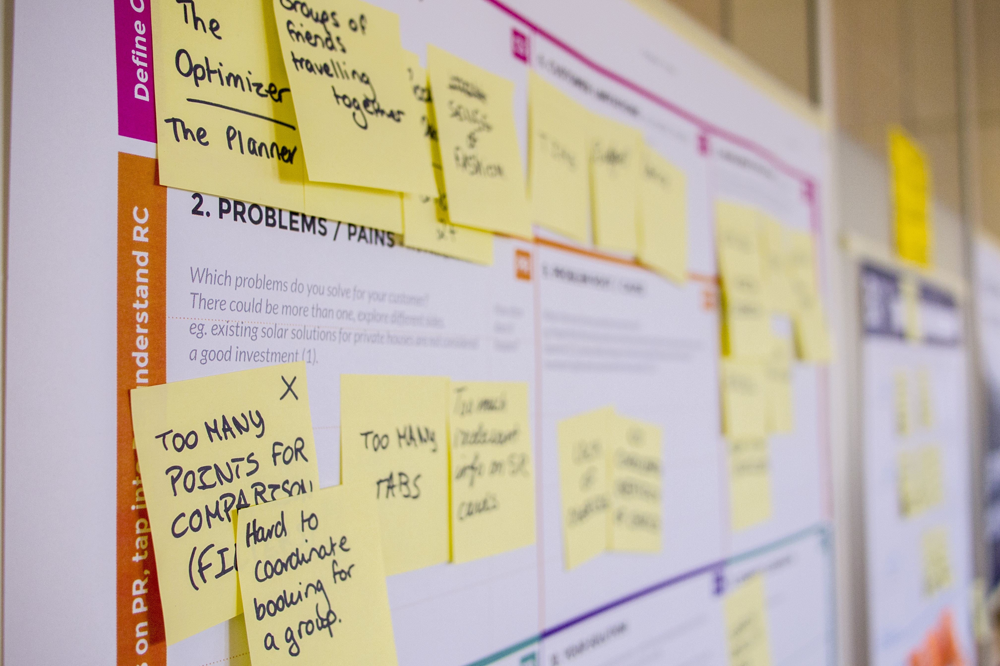

Wovon reden da alle? Was ist das? Und haben die beiden wirklich so viel gemeinsam?

### Scrum und Kanban - wovon reden denn da alle?

Seit einigen Jahren hört man immer öfter von Scrum und Kanban. Und mittlerweile sind die beiden Begriffe auch außerhalb der IT und außerhalb des Projektmanagements ein Begriff geworden. Aber so wirklich erklären, was das eigentlich ist, kann einem kaum jemand. Beziehungsweise, was ist der Unterschied zwischen Scrum und Kanban? Gibt es da überhaupt einen? Und wofür ist das alles eigentlich gut? Klären wir die einfachsten zwei Fragen zuerst.

### Scrum und Kanban - gibt es da überhaupt einen Unterschied? Und wenn ja, welchen?

Ja, den Unterschied gibt es. Einen ganz gewaltigen sogar. Das eine (Scrum) ist eine Methodik für Projektmanagement in der Softwareentwicklung auf Teamebene. Das andere (Kanban) ist eine Planungsmethode der Produktionsprozesssteuerung. Klingt furchtbar kompliziert, ich weiß. Lasst es uns vereinfachen: Scrum ist Projektmanagement, Kanban ist Prozessmanagement. Das eine verwende ich, um etwas zu verändern, das andere, um bestehende Prozesse abzuwickeln.

### Kann ich Scrum und Kanban dann überhaupt miteinander vergleichen?

Wie so oft im Leben ist die Antwort ein jein. Ja, ich kann einen Vergleich herstellen, aber der wird immer ein sehr künstlicher sein. Scrum und Kanban einander gegenüber zu stellen, ist wie wenn ich Kochen und Bügeln miteinander vergleichen möchte. Beides sind Tätigkeiten und beides hat was mit Haushalt zu tun. Aber das war es dann auch schon. Wenn Euer Agilitäts-Coach also Scrum und Kanban fröhlich miteinander vermischt, würde ich das an Eurer Stelle eher mit Vorsicht genießen. Ja, es gibt Methodiken, die Kanban als Projektmanagementtool verwenden (Scrumban, zum Beispiel). Das funktioniert, weil Projektmanagement in gewissen Sinne eine Unterkategorie des Prozessmanagements ist. Und Scrum und Kanban sind beide mehr oder weniger _agil_ (mehr dazu im nächsten Absatz). Aber im Grunde genommen, reden wir hier von zwei verschiedenen Welten.

### A propos Agilität: sind Scrum und Kanban denn nicht agil?

Und schon wieder: jein. Lasst uns das mal konkreter ansehen. Es gibt mehrere Definitionen von Agilität. Aber wenn wir rein nach der Lehre gehen, ist Kanban nicht agil. Ich weiß, überall steht, dass es das sei. Aber trotzdem ist es das nicht.  
Lasst uns mal kurz einen Blick in die Geschichtsbücher machen. Kanban hat sich aus dem _Toyota Production System_ entwickelt. Und da wird es mit mehreren anderen Tools unter dem Begriff _Lean Management_ zusammengefasst. Noch so ein Buzzword. Wobei man so fair sein muss, zu erwähnen, dass es sehr, sehr, sehr viel Diskussion darüber gibt, was _agil_ eigentlich alles beinhaltet und wo die Grenzen sind. Wobei diese Diskussion meiner Meinung nach komplett obsolet ist. Denn es geht nicht nur um die Methodiken an sich, sondern auch um das Menschenbild und das _Mindset_ (wenn wir schon fröhlich Buzzwords herumwerfen). Natürlich muss ich die Spielregeln kennen, aber das eine macht ohne das andere keinen Sinn.

### Und was ist Scrum jetzt also?

Scrum stellt uns Methoden zur Verfügung, mit deren Hilfe ein Team von drei bis neun Personen ein Projekt abwickeln kann. Ursprünglich ein reines Softwareentwicklungs-Framework, gibt es mittlerweile auch Versuche, Scrum (mit mehr oder weniger Verbiegungen) in anderen Bereichen einzusetzen. Hinter Scrum steht ein recht einfacher Gedankengang: wenn ich nicht genau weiß, wie mein fertiges Produkt am Ende des Projektes aussehen und die Umsetzung genau ablaufen wird, benötige ich kleine Schritte und viele Feedbackschleifen (_iterativ_ und _inkrementell_), um gegebenenfalls schnell (_agil_) meine Marschrichtung korrigieren zu können.

Damit das gut geht, muss ich _empirisch_ - sprich, auf Fakten basierend - arbeiten. Scrum hat deshalb (wie alle agilen Projektmanagementmethoden) ein großes Mantra: _Inspect & adapt_. Beobachte und verbessere. Und die dritte Säule in diesem Modell lässt sich daraus ableiten: Transparenz. Absolute Transparenz, wenn Ihr mich fragt. Anders kann das nicht funktionieren.  
Und damit mein Team sich nicht verzettelt und verirrt, gibt es eine Konstante: _customer value_. Was benötigt der Kunde, was hilft ihm weiter? Und wie kann ich ihm das ehestmöglich liefern und dann schrittweise verbessern?

Zur Unterstützung bekommt so ein Scrumteam zwei Rollen an die Seite gestellt. Einen Scrum Master, der Steine aus dem Weg räumt und das Team motiviert. Und einen Product Owner, der die Schnittstelle zum Kunden ist. Und um für die Transparenz, Beobachtung, und Verbesserung zu sorgen, gibt es fixe Termine. Gedacht wird in zweiwöchigen Zyklen, den sogenannten _Sprints_. Zu Beginn eines Sprints plant das Team, was es in den kommenden zwei Wochen umsetzen wird (alle Todos stehen in einer nach Kundennutzen sortierten Liste, dem _Product Backlog_). Und am Ende eines Sprints wird dem Kunden die getanene Arbeit gezeigt und Feedback eingeholt. Danach setzt das Team sich zusammen und beredet, wie es besser werden kann.

Ihr seht, da gibt es viele Wörter und Begrifflichkeiten und Besonderheiten und Tam-Tam. [Scrum driftet auch, wenn man nicht aufpasst, sehr schnell ins Rituelle ab](/too-scrum). Aber mit ein wenig Hausverstand ist es ein sehr mächtiges Werkzeug, um kleine Projekte in einem Umfeld, in dem größere Unklarheit herrscht, erfolgreich abzuwickeln.

### Und was ist Kanban jetzt also?

Auch hier beginne ich gerne mit etwas Geschichte. Wenn ich weiß, wo etwas herkommt, kann ich es besser verstehen. Außerdem: Coaches erzählen gerne die phantasievollsten Märchen, wo Kanban denn herkomme (vom Drama des zweiten Weltkrieges in England bis zu Eintrittskarten für kaiserliche Gärten im Tokio des 16. Jahrhunderts habe ich schon alles gehört). Dabei ist es fast schon banal: Toyota (die übrigens ursprünglich Webstühle herstellten) hatten in den 1940er-Jahren ziemlich Probleme mit großen Lagerständen. Auf der Suche nach Vorbildern für _Just in Time-Produktion_ kam Taiichi Ohno auf die Idee, sich mit den damals aufkommenden großen Supermärkten näher zu beschäftigen. Und aus diesen Erkenntnissen hat er Kanban formuliert.

Kanban basiert auf einer einfachen Prämisse: wenn ein Arbeiter sich sein nächstes Arbeitsstück selber organisiert (_Pull-Prinzip_) und es nicht befohlen bekommt (_Push-Prinzip_), kann er effektiver arbeiten. Dazu ist es essentiell, die Aufgaben, an denen ich gleichzeitig arbeite, zu reduzieren - das berühmte _Work in Progress-Limit_. Und dafür wiederum ist es notwendig, meine Arbeit zu visualisieren. Klingt kompliziert, ist ganz einfach. Ich schreibe alle meine Todos auf Zettel und hänge diese an ein Whiteboard mit drei Spalten: Todo, Work in Progress und Done. Und nun wird ein Zettel nach dem anderen übers Brett gezogen - sprich: ich arbeite eine Tätigkeit nach der anderen ab.

Kanban ist - anders als Scrum - sehr weit gegriffen und sehr theoretisch. Das hat den Vorteil, dass es sich nahezu überall gut einsetzen lässt. Ich habe es im Lauf der Jahre von der Produktionshalle einer Lebensmittelfabrik bis zur Buchhaltung einer Internetagentur schon in allen möglichen Bereichen erlebt.

### Und was haben Scrum und Kanban nun gemeinsam? Worum geht es im Wesentlichen?

Mit einem Wort (und das kam bereits vor): **Mindset**. Und das ist auch der Grund, warum die beiden oft in einem Atemzug genannt werden. Scrum und Kanban verschieben beide die [Verantwortung, wie die tägliche Arbeit erledigt wird](/fuehrungskraefte-und-die-umstellung-auf-agilitat) weg von den Führungskräften und hin zu den Stellen, an denen diese tägliche Arbeit auch gemacht wird. Von Taiichi Ohno, dem Formulierer von Kanban, gibt es ein schönes Zitat: “Unsere Mitarbeiter kommen nicht zu uns, um zu arbeiten, sondern um zu denken.”

Das bedeutet, dass sich Teams selbst organisieren. Das bedeutet, dass Organisationen sich neue Strukturen geben (die gute, alte Matrix feiert da oft ein Revival). Das bedeutet, dass Organisationen wesentlich transparenter werden. Müssen. Das bedeutet neues Management, neues Arbeiten, neues Denken. Und dafür gibt es keine Blaupause, das muss jede Organisation für sich finden. Scrum und Kanban sind da nur die Hilfsmittel dazu.

### Und zum Abschluß: gibt es Alternativen zu Scrum und Kanban?

Natürlich gibt es die. Ich zähle mal die bekanntesten und verbreitetesten auf, damit Ihr sie zumindest mal gehört habt und wisst, dass es da auch jenseits des Tellerrandes noch viel zu entdecken gibt. Zuerst mal zu Scrum. Agile Projektmanagementmethoden gibt es viele, unter anderem:

- Dynamic systems development method (DSDM)
- Lean software development
- Adaptive software development
- Feature-driven development (FDD)
- Rapid application development (RAD)
- mit Abstrichen Extreme Programmin (XP)

Und Kanban hat aufgrund seiner inhaltlichen Breite viele Gegenstücke und Ergänzungen im Prozessmanagement:

- Continual Improvement Process (CIP)
- Backflush Accounting
- CONWIP
- Drum-buffer-rope
- Lean manufacturing

Da muss ich mich wiederholen: welches System das beste ist, kann man da schwer sagen, dafür gibt es keine Blaupause. Das beste ist das, was für die eigene Organisation am besten funktioniert.
