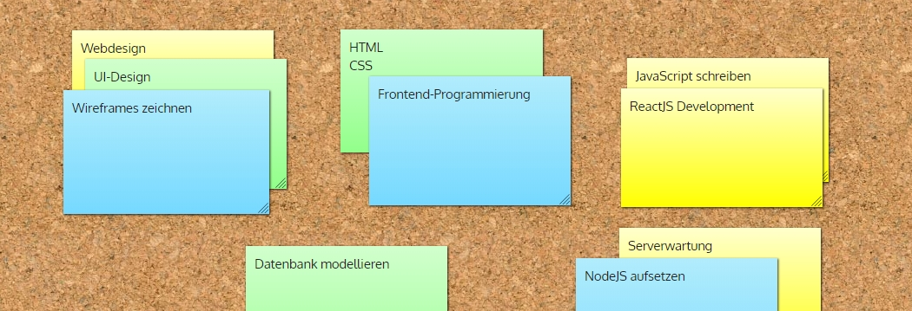
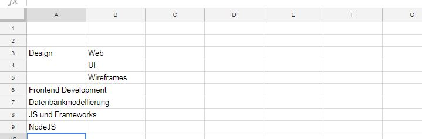
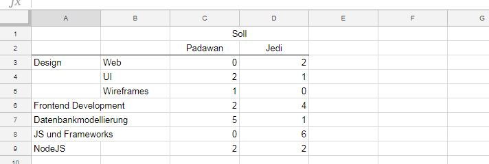
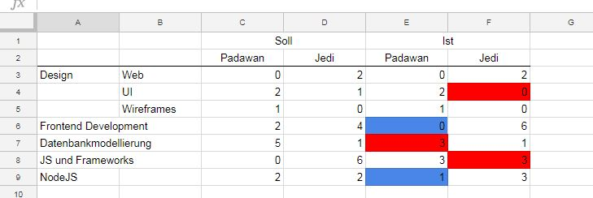

Wie ich notwendige Skills für mein Projekt erfasse und etwaige Defizite in meinem Projektteam sichtbar mache.

### Am Anfang war der Plan

Da haben wir also unsere WBS erstellt, den Critical Path berechnet, die Arbeitspakete analysiert, unser Ressource Management geplant und darauf basierend unser Projektteam zusammengestellt. Und jetzt? In allen [Metaframeworks](/modernes-projektmanagement) die ich kenne, kommt nun das, was im PMBOK-Guide so schön _Develop Project Team_ benannt wird. Das Team entwickeln und formen und vorbereiten auf die Aufgaben, die da ihrer harren. Und das ist eine wahnsinnig wichtige Tätigkeit. Studien zeigen, dass Talentdefizite eine riesen Auswirkung auf das Projektergebnis haben. Und ja, das wissen wir natürlich. Und streng nach Lehrbuch ist so ein Projektteam ja auch aus lauter Idealbesetzungen zusammengestellt.

### Manche Dinge ändern sich nie

Aber schauen wir der Realität ins Auge: im echten Leben gleicht das Zusammenstellen eines Projektteams mehr dem Feilschen auf einem Bazar, als einem geregelten Prozess. _Wenn Du mir die gute Software-Architektin gibst, nehme ich dafür die beiden schlechten Tester und Du bekommst in der zweiten Hälfte Deines Projektes das C#-Genie in Dein Team übersiedelt._ Kennen wir alle, oder? Oder aber auch: _Was soll ich bloß machen? Die Logistigexpertin ist genau während der heißen Projektphase auf Urlaub und ihr Stellvertreter hat keine Ahnung._ Haben wir alle schon oft erlebt, erleben wir und werden wir erleben. Manche Dinge ändern sich nie.

### Gemba

Wir müssen also dafür sorgen, dass die Talentdefizite behoben werden. Klingt recht logisch und auch recht einfach. Ist es aber nicht. Denn woher weiß ich denn, wo ich Wissenslücken im Team habe? Wenn ich ja noch nicht mal weiß, was für Skills genau benötigt werden. Natürlich habe ich da die Arbeitspakete und mein WBS-Dictionary (so ich denn alles richtig gemacht habe). Aber - und hier ist es wieder, unser großes Aber. Sofern ich nicht ein Projekt plane, an dem ausschließlich Projektmanager arbeiten werden, fehlt mir viel Wissen über die für die Umsetzung eines Arbeitspaketes notwendigen Skills. Selbst, wenn ich als Projektarbeiter einen fachlichen Background habe - dann tendiere ich wahrscheinlich sogar eher dazu, gut gemeinte und komplett falsche Einschätzungen abzugeben.

Was also tun? Diverse Lean Management-Methodiken haben hier einen Ausdruck, der auch im Kaizen eine wichtige Rolle einnimmt und den wir für uns nutzen können: _Gemba_, oder - je nach Romanisierung - auch _Genba_. Der Ort, an dem die Arbeit passiert. Die Halle, die Werkstatt, das Büro, die Baustelle, die Werft. _Genchi gembutsu_, “zum Gemba gehen”, ist die japanische Variante von _Management by walking around_. Und das sollten wir in unserem Fall auch tun. Denn genau dort ist das Wissen zu finden, welches wir benötigen. Klar, wer die Arbeit macht, weiß im Normalfall auch, was dazu benötigt wird.

### Alles zusammenführen

Jetzt benötigen wir also nur noch ein Werkzeug, mit dessen Hilfe wir die Informationen sammeln und die Wissenslücken unseres Teams transparent machen können. Enter stage: die Kompetenzmatrix. Und ich spreche hier nicht von der Form, wie sie uns bei der Leistungsbeurteilung in der Forschung und Lehre begegnet, sondern von einer etwas abgewandelten Form, wie ich sie im Rahmen des Teamaufbaues und der Teamführung gerne verwende.

Im Prinzip ist unsere Kompetenzmatrix ja eigentlich gar keine Matrix. Aber nichtsdestotrotz ist sie recht einfach in drei Schritten zu erstellen.

### 1. Erfassung

Als erstes erfassen wir gemeinsam mit dem Team, welche Skills im Team benötigt werden, um die anstehenden Aufgaben im Rahmen des Projektes zu meistern. Es hat sich als recht sinnvoll erwiesen, wenn die Teammitglieder sich vorher bereits Gedanken gemacht haben.  
Zusätzlich gibt es da oft auch Fachexperten außerhalb des Teams, die da Erfahrungen und Wissen haben. Diese sollte ich unbedingt (zumindest in der Vorbereitung) hinzuziehen. Und ich als Projektmanager kann da natürlich auch sehr viel Input beisteuern.

Von der Methodik her arbeite ich hier gerne mit Kanban-Ideen. Genauer gesagt, mit _Visualisierung der Arbeit_, nur in etwas abgespeckter Form. Das Team setzt sich in einem Raum zusammen und im Grunde kritzelt jede und jeder auf Klebezettel, was in ihren Augen so an Skills notwendig ist. Das Ganze wird dann geclustert und - ganz wichtig - zusammengefasst. Ich will ja nicht, dass meine Kompetenzmatrix ausufert. Das kann ich als Moderatorin oder Moderator aber recht gut steuern.  
Und dieses ganze Konvolut packe ich dann in eine Tabelle.

### 2. Von Jedis und Padawans

Im nächsten Schritt geht es darum, gemeinsam mit dem Team (und etwaigen Fachexperten) herauszufinden, wie viele Teammitglieder sich in den jeweiligen Skills auskennen sollten. Hier ist eine kleine Differenzierung oft äußerst wertvoll. Ich für meinen Teil komme eigentlich immer mit zwei Skill Level aus. Und nachdem ich a) ein Kind der 80er Jahre und b) somit ein Star Wars-Fan bin, nenne ich diese beiden Level gerne [_Padawan_](https://en.wikipedia.org/wiki/Jedi#Padawan) und [_Jedi_](https://en.wikipedia.org/wiki/Jedi). Ihr könnt aber natürlich auch Pinky und Brain, Halbprofis und Profis, Experten und Superexperten, oder jede andere Kombination nehmen. Und ja, natürlich spricht auch nichts gegen drei Niveaustufen. Wobei ihr hierbei bedenken solltet, dass Eure Kompetenzmatrix dann recht schnell unübersichtlich wird.  
Und der Vollständigkeit halber: in meinen Augen ist es sinnvoll, dass die Anzahl von etwaigen Padawans nicht extra zu den Jedis dazugerechnet wird. Wenn ich also in einem Skill 2 Halbprofis und 1 Profi benötige, schreibe ich das auch so in meine Tabelle.

### 3. Von Soll zu Ist

Der nächste Schritt sollte eigentlich logisch sein. Wenn ich zuerst den Soll-Stand ermittelt habe, möchte ich natürlich auch den Ist-Stand herausfinden. Dabei ist es wichtig, dass ich bereits die Möglichkeit hatte, in meinem Team eine Atmosphäre der Sicherheit zu schaffen. [Agile Projektmanager](/fuehrungskraefte-und-die-umstellung-auf-agilitaet) haben hier einen Vorteil, aber eigentlich hat das weniger mit “Agilität”, sondern mehr mit einer offenen Kultur zu tun. Denn nur, wenn meine Teammitglieder sich sicher fühlen, haben sie auch den Mut, zuzugeben, dass sie sich in manchen Bereichen ihrer Domäne nicht so sehr auskennen, wie in anderen.

Jetzt muss ich nur mehr die Differenzen zwischen Soll und Ist berechnen und e voila, ich habe meine Kompetenzmatrix. Dabei gibt es einen kleinen Punkt zu beachten. Schaut z.B. mal auf die Padawans in Zeile 6 (_Frontend Development_) meines Bespieles. Ich benötige 2 und habe 0. Eigentlich hätte ich hier also ein Skilldefizit. Allerdings habe ich 2 Jedis mehr, als ich benötige. Die (über-)erfüllen hier also die Padawan-Rolle. Logisch, oder?

### Von Schubladen und Leben

So, und jetzt wird es noch einmal spannend. Denn was machen wir denn mit all unseren RACI-Matrizen, Ablaufdiagrammen, und ähnlichen, sobald sie erstellt sind? Wir stecken sie in irgendeine Schublade. Eine Kompetenzmatrix (und alle RACI-Matrizen, Ablaufdiagramme, und ähnliches) muss leben! Wenn ich sie nicht immer wieder gemeinsam aktualisiere und Schulungsbedarf offen im und mit dem Team kommuniziere, kann ich es gleich bleiben lassen. Nicht die Kompetenzmatrix, sondern Projektmanagement im Allgemeinen. My two cents.

Sprich, wir sollten unsere Kompetenzmatrix wo für alle gut sichtbar aufhängen. Ein klassischer _Informationsradiator_ quasi. Dann haben nämlich auch alle was davon. Die Teammitglieder Weiterbildung, die Organisation gut ausgebildete Mitarbeiter und wir als Projektmanager ein gutes Projektteam. Und damit haben wir eigentlich schon gewonnen.
