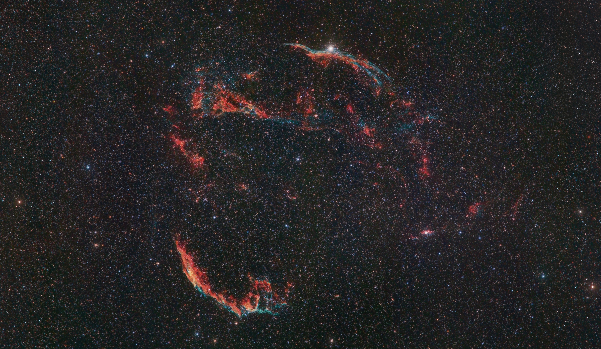

Eine Geschichte über Google, Pair Programming, das Weltall, den Zufall, und die Gelassenheit.

### Eine kleine Geschichte

Im Frühjahr 2000 passierten zwei Dinge, die für die Welt der Technologie große Auswirkungen haben sollten. Anfang März platzte die Dotcom-Blase. Und Google steckte in ordentlichen Schwierigkeiten. Weniger finanzieller Art, sondern Schwierigkeiten, die sich substanziell auf das Unternehmen auszuwirken drohten. Einige Monate zuvor hatte der Crawler der Googlebot-Software aufgehört, ordentlich zu arbeiten. Das ist jene Software, die das Internet durchforstet, die Inhalte indexiert, in eine Reihenfolge bringt und uns als Suchergebnis präsentiert. Also die Kerntechnologie einer Suchmaschinenfirma wie Google. 

Keiner hatte eine Ahnung, warum die Software nicht mehr das tat, wofür sie programmiert worden war. Entwickler und Techniker versuchten verzweifelt, die Ursache des Problems zu finden – erfolglos. Der Crawler lief eine Zeit lang und stürzte dann ab. Neustart. Absturz. Neustart. Absturz. Die Suchmaschine selbst funktionierte noch. Allerdings waren die gelieferten Resultate mehrere Monate alt.

### Bedrohungsszenarien

Zur gleichen Zeit steckte die Leitung von Google in Verhandlungen mit Yahoo über einen Deal, der das junge Unternehmen auf die nächste Stufe hieven sollte. Google sollte für Yahoo Seiten indexieren. Und ein veralteter Suchindex, der sich nicht mehr aktualisierte, hätte nicht nur die Verhandlungen 
platzen lassen, sondern Google gesamt bedroht. Eine Suchmaschine, die keine aktuellen Resultate liefern kann, wäre auch vor 20 Jahren schnell weg vom Fenster gewesen.

Das Problem war bekannt. Der Google-Crawler hatte keine Toleranz gegenüber Hardware-Fehlern. Er war ein Sammelsurium aus Skripts, im Laufe der Zeit zu dem gewachsen, was er war. Und die Hardware war mitgewachsen. Je größer der Suchindex wurde, desto mehr Rechner benötigte er. Nun hatte Google als Startup keine Hochleistungsserver, sondern einfache Massenware. Ein Netzteil, ein Motherboard, und eine Festplatte zusammengetackert, fertig.

### 0 und 1

Im März 2000 war es endlich soweit: ein Index konnte erstellt werden. Die letzten Atemzüge des alten Crawlers. Und der erste Test zeigte schnell, dass er so nicht veröffentlicht werden konnte. Zu viele Fehler enthielt er, zu defekt war der Pagerank. Larry Page und Sergey Brin zogen die Notbremse und steckten ihre sechs besten Entwickler mit Laptops und viel Kaffee in einen Konferenzraum. Mit dabei waren Jeff Dean und Sanjay Ghemawat, zwei der genialsten Köpfe weit und breit. Die beiden begannen schnell, den Code auf seiner tiefsten, rudimentärsten Ebene zu betrachten - Nullen und Einsen.

Und da fiel ihnen etwas auf: hin und wieder war eine Null, wo eine Eins hätte sein sollen. Und umgekehrt. Und jetzt müssen wir einen kurzen Abstecher in eine komplett andere Ecke machen. Astrophysik. Wenn ein Stern stirbt, explodiert er in einer sogenannten Supernova. Dabei leuchtet er kurzzeitig so hell auf, wie eine ganze Galaxie. Und dabei werden Energiepartikel als kosmische Strahlung durch das All geschleudert. Wenn ein solches Partikel nun auf einen Prozessor oder einen 
Datenspeicher trifft, kann es eine Null oder eine Eins umschalten. Ein sogenannter _Soft Error_ tritt auf, eine temporäre Datenänderung. An sich kein Problem. Für Googles improvisierte Melange aus 
Billighardware und Codechaos war es allerdings eine unüberwindbare Hürde.

### Das gute Ende

Jeff Dean und Sanjay Ghemawat begannen also, die Codebasis auf neue Beine zu stellen. Und schrittweise wurde a) die Software stabiler, schneller, besser und b) Google zu dem, was es heute ist.  
Das ist an sich eine nette Geschichte. Eine Parabel über die Komplexität in dynamischen Systemen. Eine Überzeugungshilfe für all jene von uns, deren Teams keine Sinnhaftigkeit in Pair Programming sehen (Dean und Ghemawat programmieren übrigens auch heute noch viel gemeinsam). Es kann auch ein Aufruf zu mehr Auge für Details sein. Für mich ist aber vor allem ein Aspekt interessant.

### Manche Ereignisse haben keinen Grund

Manche Ereignisse haben keinen Grund. Eine Ursache, ja. Aber keinen Grund. Sie passieren einfach. Und andere Ereignisse wiederum haben zwar einen Grund. Der ist es aber nicht wert, sich auch nur eine Sekunde den Kopf darüber zu zerbrechen.  
Ich weiß, wir bilden alle brav in unserem Risk Management alle möglichen potentiellen Katastrophenszenarien und die jeweilige Lösung ab. Und wir Menschen haben ja auch generell die Tendenz, kein unkalkuliertes Risiko einzugehen. Und wenn dann ein (positives oder negatives) Ereignis eintritt, ist oft Feuer am Dach. Und da wird dann viel Energie aufgewendet, eine Ursache (und ganz gerne auch Schuldige) dafür zu finden. Nur wozu? Manche Dinge sind so, wie sie sind. Manche Ereignisse haben keinen Grund.

### Das bessere Ende

Was machen wir also, wenn wir erkannt haben, dass so ein Ereignis eingetreten ist? Ganz einfach: kann ich Learnings mitnehmen? Wenn ja, dann mach ich das. Genau dafür haben wir ja unser _Lessons Learned-Management_. Dokumentieren, dann freut sich die oder der nächste. Wenn ich keine Learnings mitnehmen kann, dann eben nicht. Fertig. Abgehakt. Danke, nächstes Thema. Ein wenig mehr Gelassenheit tut uns allen gut. Das Leben als Projektarbeiter ist nämlich viel zu ereignisreich, um sich unnötige Gedanken zu machen.
