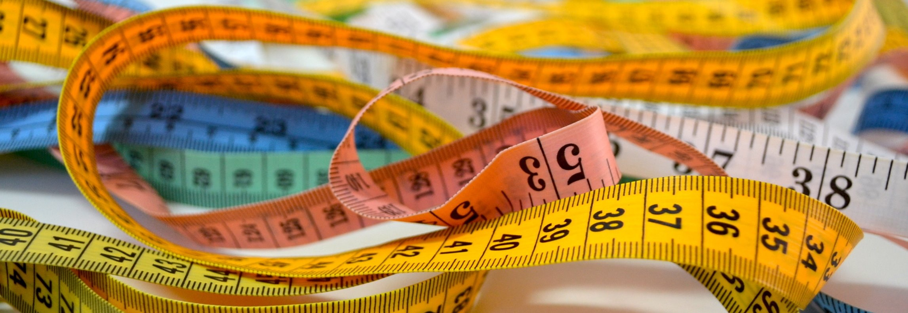

Wie kann ich in Scrum, Kanban und co eigentlich Produktivität messen.

### afdsa

Bei aller Agilität ist die Realität eher unromantisch: unterm Strich muss ich als Unternehmen mit einer Investition mehr Geld verdienen, als ich dafür ausgebe. Sonst kann ich es gleich bleiben lassen. Deshalb fragen sich viele Organisationen (und noch mehr Controller), wie sie die Produktivität eines Scrum Masters überhaupt messen sollen. Ist die Job Description [doch recht schwammig formuliert](/das-doppelte-trilemma-der-scrum-master). Dabei ist das eigentlich recht einfach:

> PSM = (CSM - ISM) / NoT

| Abkürzung | Bedeutung |
| --- | --- |
| PSM | Produktivität Scrum Master |
| CSM | Kosten Scrum Master |
| ISM | Impact Scrum Master |
| NoT | Number of Teammembers |

Schwierig, wenn nicht ein SM je Team => Group of Coaches.

