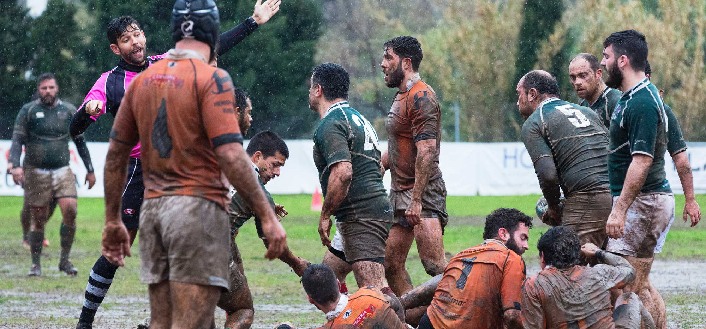

Viel wird über Scrum erzählt, geschrieben, erklärt, vorgetragen. Doch was von all dem stimmt überhaupt? Gibt es so etwas wie die absolute reine Wahrheit, wenn es um Scrum geht? Worum geht es bei Scrum eigentlich? Und kann man das wirklich in zehn Minuten erklären?

### Die Essenz

Ich erlebe oft, dass Scrum für alles mögliche angepriesen wird. Die eierlegende Projektprogrammportfolioprozessmanagementwollmilchsau. (Was für ein Wort!) Aber was ist Scrum eigentlich? Eine Methodik? Eine Methode? Ein Framework? Die Antwort auf eh alles? Die Lösung ist sehr einfach. Scrum ist

1. eine Sammlung von Werkzeugen, mit deren Hilfe
2. Softwareentwicklungsteams
3. auf Teamebene
4. in der Projektarbeit
4. ihr Tagesgeschäft organisieren können.

Nicht mehr und nicht weniger. Aber lasst uns das mal näher ansehen.

### Anwendungsgebiete von Scrum

"Eine Sammlung von Werkzeugen" also. Das klingt so banal. Aber jeder, der Scrum als Methodik bezeichnet, 
hat noch nie einen Blick in den [Scrum Guide](https://www.scrumguides.org/index.html) geworfen. 
Der hat nämlich original 16 Seiten Inhalt. Versteht mich nicht falsch, mehr braucht es auch nicht. 
Ich bin der Meinung, die Anleitung für Scrum ist bewusst sehr schlank gehalten. Aber 16 Seiten sind 
nichtsdestotrotz ein bisschen wenig für ein Framework oder eine Methodik.  
Andererseits: mit der Philosophie hinter Scrum kann man ganze Bücher füllen. Aber dazu später mehr.

Scrum ist für Softwareentwicklungsteams konzipiert. Genauer gesagt, für **ein** Softwareentwicklungsteam. 
Und auch nur dann, wenn dieses Team in der Arbeit für ein Projekt (und ja, ich schreibe hier bewusst von "Projekt" - 
Ihr könnt das auch ruhig Epic, Vorhaben, Action, Etappenteil nennen. Ein Projekt ist ein Projekt, ist ein Projekt. 
Oder anders formuliert: _If it walks like a project and quacks like a project, it is a project._) steckt, 
dass einen [gewissen Komplexitätsgrad erreicht hat](/modernes-projektmanagement-der-methodische-teil#die-qual-der-wahl). 
Hier ist das Anwendungsgebiet also sehr klein. Und es wird noch kleiner, wenn ich berücksichtige, 
dass Scrum für die Abwicklung des Tagesgeschäftes gedacht ist. Risk Handling, Programmmanagement, Ressourcenplanung, etc. 
sucht man im Scrum Guide vergeblich.

### Von Run und von Change

Jetzt muss ich einen kurzen Absatz über Run und Change einschieben. Run ist mein Tagesgeschäft. Change ist meine Veränderung. 
Früher war das einfach. Ich habe als Unternehmen viel Run gemacht. und ab und zu kam ein Projekt um die Ecke 
und hat meine Organisationsform - mal mehr, mal weniger - verändert. Und dann ging es wieder weiter mit Run.  
Heute habe ich oftmals mehrere parallele Change-Prozesse in meiner Organisation, die sich überschneiden und 
sich gegenseitig - und, noch schlimmer, mein Tagesgeschäft - direkt beeinflussen. Deshalb ist es hier in meinen Augen 
unumgänglich, sauber zu trennen. Scrum ist Change. Punkt.

### Die Philosophie hinter Scrum

Scrum ist - wie vieles in der agilen Welt - stark von [fernöstlichen Denkweisen beeinflusst](/warum-im-projektmanagement-so-viel-ueber-fernoestliche-philosophie-geredet-wird). Sprich, ich versuche zu erreichen, dass mein Team sich stetig entwickelt, um für meine Kunden einen höchstmöglichen Wert zu erzeugen. Damit das klappt, muss ich ständig auf der Suche nach ungehobenen Potentialen sein. _Inspect & Adapt_ ist der Terminus, der hier oft und gerne verwendet wird. In Scrum ist dieses konstante Verbessern der Organisation des Arbeitsablaufes Aufgabe des ganzen Teams. Jede und jeder steht in der Verantwortung. Für sich, das Team, das Produkt. Und hierfür habe ich Transparenz als Grundbedingung. Ohne Offenheit kann ich das Alles bleiben lassen, dann wird es nicht funktionieren.

### Der Ablauf von Scrum

Jetzt haben wir das Drumherum geklärt, also ab ans Eingemachte. Wie geht Scrum? Ich will Euch hier jetzt nicht 
die Artefakte und Zeremonien vor den Latz knallen. a) kann die jede und jeder [nachlesen](https://www.scrumguides.org/index.html). 
Und b) bin ich dann keinen Deut besser, als die von mir so gerne kritisierten Blender. 
(Der _Deut_ war übrigens eine alte holländische Münze - damit hätten wir unsere diesmalige Portion unnützes Wissen auch erledigt.)

Scrum ist wahnsinnig einfach. In der Theorie zumindest. Um die Komlexität greifbarer zu machen, plane ich mein 
Projekt nicht vor dem Umsetzungsstart komplett durch, sondern teile es - ähnlich wie beim 
_Rolling Wave Planning_ - in kleinere und leichter verdauliche Häppchen auf. 
Diese Iterationen (_Sprints_ genannt) dauern zwischen zwei und acht Wochen. Ich beobachte sehr häufig vier Wochen als 
das Mittel der Wahl.  
Alle paar Wochen also setzt sich das Scrumteam zusammen und 

1. lädt die Kunden ein, um ihnen den aktuellen Stand zu zeigen und Feedback einzuholen (und ja, _Kunde_ ist hier ein sehr schwammiger Begriff), 
2. bespricht im Rahmen einer _Retrospektive_, was am letzten Sprint gut war, was nicht so gut war und wo und vor allem wie man sich verbessern will, und 
3. nimmt sich vor, was im kommenden Sprint umgesetzt wird.

Während eines Sprints analysiert das Team die neu hinzugekommenen Aufgaben. Sind sie so wie beschrieben umsetzbar? Und wie aufwändig sind sie in etwa?  
Diese Aufgaben finden sich in einer Liste. Der oft gehörte _Product Backlog_. Ganz oben steht die Aufgabe mit dem höchsten Kundenwert, gefolgt von der mit dem zweithöchsten Kundenwert, gefolgt von der mit dem dritthöchsten Kundenwert, und so weiter und so fort. Ihr erkennt das Muster.

### Das Scrumteam

A propos Team: das besteht in Scrum aus 

- (meistens fünf, die Zahl hat sich auch schon vor Scrum bewährt) Softwareentwicklern, 
- einem _Product Owner_, und 
- einem _Scrum Master_, der schaut, dass das Werk funktioniert.

Der Product Owner ist die Schnittstelle zwischen Kunden und Team. Sie oder er verbringt viel Zeit 
mit den Kunden, um herauszufinden, was diese benötigen. Und zwar, welche Funktionalität gebraucht wird. 
Das Resultat wird in sogenannten _User Stories_ niedergeschrieben. _User_, weil der Kunde 
im Mittelpunkt steht. _Story_, weil Prosaform verständlicher ist: **wer** will **was**, **um was zu erreichen**.  
Ganz wichtig sind hier Customer Value und Akzeptanzkriterien, damit ich mich nicht im Kleinklein verirre, sondern eine gewisse Wertigkeit der Arbeit gewährleisten kann.

Das war es im Großen und Ganzen. Wie versprochen kurz und knackig. Scrum ist in seinem Grundwesen sehr einfach gehalten. Kurze Feedbackzyklen und kurze Planungszyklen. Das ist natürlich auch mit einem gewissen Overhead verbunden.

### Und wofür betreibe ich dann den Aufwand mit Scrum?

Die Frage ist relativ leicht zu beantworten. Wenn ich 

- als Organisation in einem Umfeld tätig bin, in dem ich mit meinem Softwareprojekten eine möglichst kurze _Time-to-market_ benötige - also schnell Wert für den Kunden generieren möchte, weil der Kunde dann Wert für mich in Form von Geld generiert. Und wenn ich 
- mit meinen Softwareprojekten eine hohe Ungewissheit habe, was ich wie machen muss.

In allen anderen Szenarien ist Scrum wahrscheinlich nicht das Richtige für mich. My two cents. Aber das sprengt den Rahmen der zehn Minuten.
